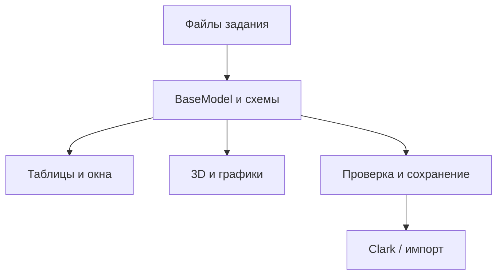

# Архитектура UI Editor

Обновлено: 2026-09-15 00:20 UTC+3.

## Назначение

Документ даёт человеку краткое представление об устройстве `web-gui`.
Технические контракты, полный перечень инвариантов и карта файлов вынесены в
AI-документы, перечисленные в [разделе «Подробная документация»](#подробная-документация).

UI Editor — браузерное приложение для просмотра, проверки и редактирования
исходных данных Clark. Оно не выполняет полевой расчёт: редактор подготавливает
файлы задания, а установленный локально Clark запускается через отдельный
Windows-протокол.

## Общая схема

Приложение выбирает каталог проектов через File System Access API, читает
поддерживаемые файлы `input3XX` и преобразует их в общую модель. Вкладки и
дополнительные окна работают с представлениями этой модели. После проверки
изменения записываются обратно в каталог задания.

## Основные части

### Модель и схемы

Схемы определяют состав вкладок, свойства и способы представления данных.
`StorageModel` соответствует файловому хранению, `BaseModel` является общей
предметной моделью приложения, а Tabulator ViewModel — временным табличным
представлением. Вычисляемые свойства и служебные поля не записываются как
исходные данные.

### Пользовательский интерфейс

Корневой SolidJS-компонент координирует выбор и загрузку задания, вкладки,
диагностику, сохранение и дополнительные окна. Таблицы строятся единообразно по
схемам. Графики, генераторы временных зависимостей, библиотеки материалов и
область деталей используют специализированные сервисы, а не собственные копии
модели.

### Валидация и сохранение

Проверки разделены на ограничения отдельного значения и согласованность модели.
Ошибочное значение допускается ввести, но оно получает диагностику. Перед
записью создаётся защитный маркер; он удаляется только после успешного
сохранения и свежей общей проверки без ошибок.

### 3D-представление

Three.js-визуализация строится как производная сцена из текущей BaseModel и не
изменяет исходные данные. Она показывает геометрию, дискретизацию, движения,
симметричные образы и заданные источники в выбранный момент времени.
Solver-совместимые геометрические преобразования изолированы в чистых модулях.

### Библиотеки материалов

Неизменяемые базовые библиотеки входят в ресурсы приложения. Локальные
библиотеки задания читаются и сохраняются отдельно от BaseModel, имеют
собственные ревизии и Undo/Redo. Импорт legacy-характеристик выполняют
специализированные преобразователи.

### Интеграция с Clark

Редактор формирует переносимый `clark.tasks.txt`, позволяет связывать выбранный
базовый каталог с установленным Clark и запрашивать запуск решателя, клиента
электрической цепи или импорта через `clark://`. Обработчик протокола, MPI и
исполняемые файлы принадлежат поставке Clark, а не браузерному приложению.

## Архитектурные принципы

- У каждой изменяемой сущности и каждого производного знания один владелец.
- Схема задаёт контракт данных; визуальные компоненты не дублируют предметную
  логику.
- Registry-архитектура позволяет добавлять форматтеры, редакторы, валидаторы и
  представления без изменения общих диспетчеров.
- File I/O, чистые преобразования и отображение разделены.
- Порядок исходных записей сохраняется; сортировка таблицы не меняет модель.
- Readonly- и вычисляемые представления не образуют второй канал записи.
- Математика, перенесённая из solver, должна оставаться прослеживаемой до
  конкретного Julia-источника.
- Неподдерживаемые возможности браузера и ошибки файловых разрешений
  диагностируются явно.

Полный нормативный перечень находится в
[`AI_ARCHITECTURAL_RULES.md`](AI_ARCHITECTURAL_RULES.md).

## Внешние границы

| Граница | Ответственность web-gui | Внешняя ответственность |
|---|---|---|
| Каталог задания | Выбор, чтение, диагностика и безопасная запись поддерживаемых файлов. | Пользователь предоставляет разрешение и корректное дерево проекта. |
| Clark | Список заданий и URI-запрос действия. | Обработчик `clark://`, исполняемые файлы, MPI, расчёт и импорт. |
| Примеры | Публикация списка, загрузка и запись с контролем размера. | Хостинг доступен по HTTP(S); исходные legacy-данные принадлежат solver. |
| Результаты | Чтение текстовой сводки без преобразования. | Solver создаёт `output3XX/_summary_out.txt`. |
| Браузер | Проверка безопасного контекста и наличия API. | Браузер управляет разрешениями, системными диалогами, WebGL и clipboard. |

## Подробная документация

- [Политика документации](../DOC_POLICY.md) — порядок входа и владельцы тем.
- [Карта файлов](AI_FILES.md) — модули, точки входа и зависимости.
- [Архитектурные правила](AI_ARCHITECTURAL_RULES.md) — инварианты и запреты.
- [Контракты данных](AI_DATA_CONTRACTS.md) — модель, схемы, сериализация,
  валидация и сохранение.
- [Контракты интерфейса](AI_UI_CONTRACTS.md) — таблицы, окна, графики,
  генераторы и 3D.
- [Интеграция с Clark](AI_CLARK_INTEGRATION.md) — данные solver, список
  заданий и локальный запуск.
- [Сборка и выполнение](AI_BUILD_AND_RUNTIME.md) — dev, release, Pages и Caddy.
- [Проверка](AI_VERIFICATION.md) — команды и критерии свидетельств.
- [Текущие вопросы](AI_ARCHITECTURE_AUDIT.md) и
  [порядок работ](AI_ROADMAP.md).

Архитектурное изменение сначала согласуется и фиксируется у канонического
владельца, затем реализуется по
[`AI_IMPLEMENTATION_PROTOCOL.md`](AI_IMPLEMENTATION_PROTOCOL.md).
